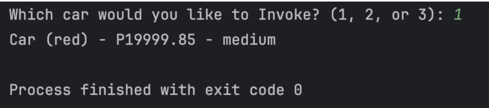

# Finals Lab Task 1

# Source Code:

class Car:
   def __init__(self, color: str, price: float, size: str):
       self.__color = color
       self.__price = price
       self.__size = size.upper()  # standardize to uppercase

   def get_color(self) -> str:
       return self.__color

   def get_price(self) -> float:
       return self.__price

   def get_size(self) -> str:
       return self.__size

   def set_color(self, color: str) -> None:
       self.__color = color

   def set_price(self, price: float) -> None:
       self.__price = price

   def set_size(self, size: str) -> None:
       self.__size = size.upper()

   def __str__(self) -> str:
       # Determine size descriptor
       if self.__size == 'S':
           descriptor = "small"
       elif self.__size == 'M':
           descriptor = "medium"
       elif self.__size == 'L':
           descriptor = "large"
       else:
           descriptor = "unknown"

       # Return formatted string
       return f"Car ({self.__color}) - P{self.__price:.2f} - {descriptor}"

if __name__ == "__main__":
   choice = input("Which car would you like to Invoke? (1, 2, or 3): ")

   if choice == "1":
       c1 = Car("red", 19999.85, "M")
       print(c1)
   elif choice == "2":
       c2 = Car("blue", 50000.00, "L")
       print(c2)
   elif choice == "3":
       c3 = Car("green", 12345.67, "S")
       print(c3)
   else:
       print("Invalid choice.")

Sample Output:

