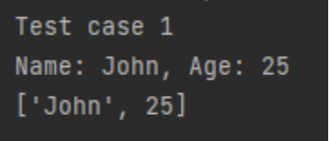
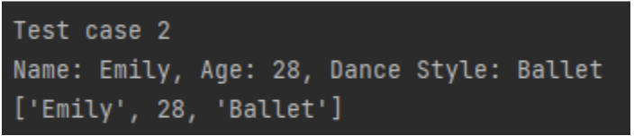
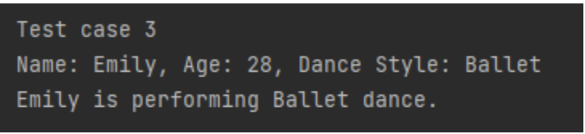
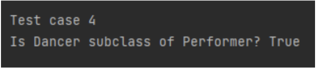
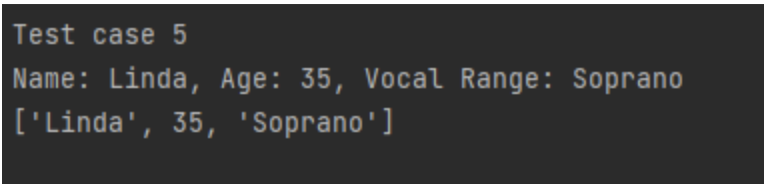
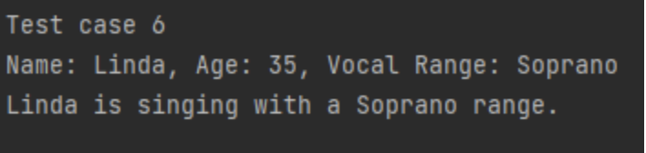

# Source Code

Performer:
class Performer:
   def __init__(self, name: str, age: int):
       """Initializes the name and age properties."""
       self.name = name
       self.age = age

   def get_name(self) -> str:
       """Returns the name of the performer."""
       return self.name

   def get_age(self) -> int:
       """Returns the age of the performer."""
       return self.age

Singer:
from performer import Performer

class Singer(Performer):
   def __init__(self, name: str, age: int, vocal_range: str):
       """Initializes name, age, and vocal range."""
       super().__init__(name, age)
       self.vocal_range = vocal_range

   def get_vocal_range(self) -> str:
       """Returns the vocal range of the singer."""
       return self.vocal_range

   def sing(self) -> None:
       """Prints what the singer is doing."""
       print(f"Name: {self.name}, Age: {self.age}, Vocal Range: {self.vocal_range}")
       print(f"{self.name} is singing with a {self.vocal_range} range.")
Dancer:
from performer import Performer

class Dancer(Performer):
   def __init__(self, name: str, age: int, dance_style: str):
       """Initializes name, age, and dance style."""
       super().__init__(name, age)
       self.dance_style = dance_style

   def get_dance_style(self) -> str:
       """Returns the dance style of the dancer."""
       return self.dance_style

   def dance(self) -> None:
       """Prints what the dancer is performing."""
       print(f"Name: {self.name}, Age: {self.age}, Dance Style: {self.dance_style}")
       print(f"{self.name} is performing {self.dance_style} dance.")
Test Class:
from performer import Performer
from singer import Singer
from dancer import Dancer

def main():
   print("Test case 1")
   p = Performer("John", 25)
   print(f"Name: {p.get_name()}, Age: {p.get_age()}")
   print([p.get_name(), p.get_age()])

   print("\nTest case 2")
   emily = Dancer("Emily", 28, "Ballet")
   print(f"Name: {emily.get_name()}, Age: {emily.get_age()}, Dance Style: {emily.get_dance_style()}")
   print([emily.get_name(), emily.get_age(), emily.get_dance_style()])

   print("\nTest case 3")
   emily.dance()

   print("\nTest case 4")
   print("Is Dancer subclass of Performer?", issubclass(Dancer, Performer))

   print("\nTest case 5")
   linda = Singer("Linda", 35, "Soprano")
   print(f"Name: {linda.get_name()}, Age: {linda.get_age()}, Vocal Range: {linda.get_vocal_range()}")
   print([linda.get_name(), linda.get_age(), linda.get_vocal_range()])

   print("\nTest case 6")
   linda.sing()

if __name__ == "__main__":
   main()

# Sample Outputs

Output 1:

Output 2:

Output 3:

Output 4:

Output 5:

Output 6:
