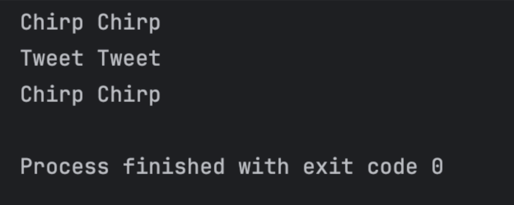

# Finals Task 3

# Sample Code
bird.py:
from abc import ABC, abstractmethod

class Bird(ABC):

    @abstractmethod
    def make_sound(self) -> None:
        """No sound..."""
        pass
sparrow.py:
from bird import Bird

class Sparrow(Bird):

    def make_sound(self) -> None:
        print("Chirp Chirp")
parrot.py:
from bird import Bird

class Parrot(Bird):

    def make_sound(self) -> None:
        print("Tweet Tweet")
birdCage.py:
from typing import List
from bird import Bird

class BirdCage:

    def make_bird_sounds(self, birds: List[Bird]) -> None:
        for bird in birds:
            bird.make_sound()
test.py:
from sparrow import Sparrow
from parrot import Parrot
from birdCage import BirdCage

cage = BirdCage()
birds = [Sparrow(), Parrot(), Sparrow()]

cage.make_bird_sounds(birds)

# Sample Output

