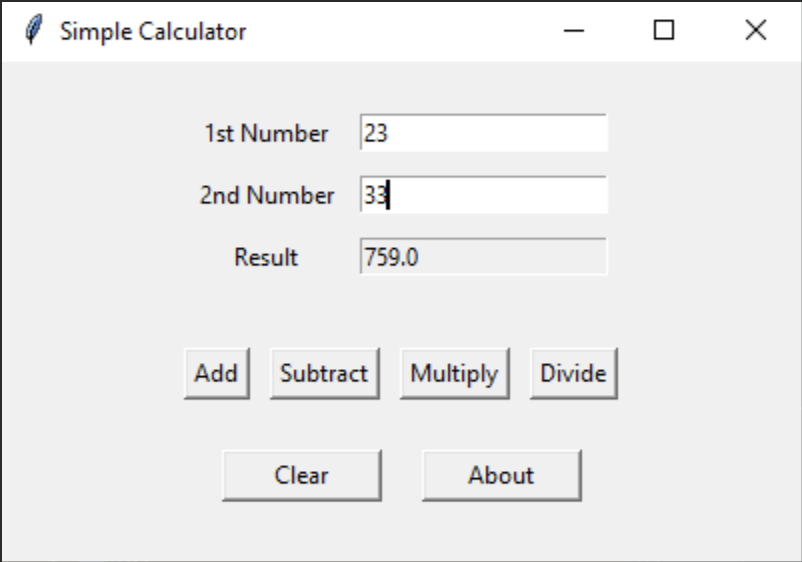

# Finals Task 4

# Source Code
from tkinter import *
from tkinter import messagebox

class SimpleCalculator:

  def __init__(self, root):
      self.root = root
      self.root.title("Simple Calculator")
      self.root.geometry("400x250")

      input_frame = Frame(self.root)
      input_frame.pack(pady=20)

      Label(input_frame, text="1st Number").grid(row=0, column=0, padx=5, pady=5)
      self.num1 = Entry(input_frame, validate="key")
      self.num1["validatecommand"] = (self.num1.register(self.validate_input), "%P")
      self.num1.grid(row=0, column=1, padx=5, pady=5)

      Label(input_frame, text="2nd Number").grid(row=1, column=0, padx=5, pady=5)
      self.num2 = Entry(input_frame, validate="key")
      self.num2["validatecommand"] = (self.num2.register(self.validate_input), "%P")
      self.num2.grid(row=1, column=1, padx=5, pady=5)

      Label(input_frame, text="Result").grid(row=2, column=0, padx=5, pady=5)
      self.result = Entry(input_frame, state="readonly")
      self.result.grid(row=2, column=1, padx=5, pady=5)

      button_frame = Frame(self.root)
      button_frame.pack(pady=10)

      Button(button_frame, text="Add", command=self.add).grid(row=0, column=0, padx=5)
      Button(button_frame, text="Subtract", command=self.subtract).grid(row=0, column=1, padx=5)
      Button(button_frame, text="Multiply", command=self.multiply).grid(row=0, column=2, padx=5)
      Button(button_frame, text="Divide", command=self.divide).grid(row=0, column=3, padx=5)

      bottom_frame = Frame(self.root)
      bottom_frame.pack(pady=15)

      Button(bottom_frame, text="Clear", width=10, command=self.clear_all).pack(side=LEFT, padx=10)
      Button(bottom_frame, text="About", width=10, command=self.show_about).pack(side=LEFT, padx=10)

  def validate_input(self, new_value):
      """Allow only digits or empty input."""
      if new_value == "" or new_value.isdigit():
          return True
      messagebox.showerror("Invalid Input", "Text is not allowed. Numbers only!")
      return False

  def add(self):
      self.calculate(lambda x, y: x + y)

  def subtract(self):
      self.calculate(lambda x, y: x - y)

  def multiply(self):
      self.calculate(lambda x, y: x * y)

  def divide(self):
      try:
          self.calculate(lambda x, y: x / y)
      except ZeroDivisionError:
          messagebox.showerror("Error", "Cannot divide by zero.")

  def calculate(self, operation):
      """Retrieve input values, perform the operation, and show the result."""
      try:
          num1 = float(self.num1.get())
          num2 = float(self.num2.get())
          result = operation(num1, num2)

          self.result.config(state="normal")
          self.result.delete(0, END)
          self.result.insert(0, result)
          self.result.config(state="readonly")

      except ValueError:
          messagebox.showerror("Error", "Invalid input.")

  def clear_all(self):
      self.num1.delete(0, END)
      self.num2.delete(0, END)
      self.result.config(state="normal")
      self.result.delete(0, END)
      self.result.config(state="readonly")

  def show_about(self):
      messagebox.showinfo("About", "Work of Jacob Gavin M. Due")

if __name__ == "__main__":
  root = Tk()
  SimpleCalculator(root)
  root.mainloop()

# Sample Output
