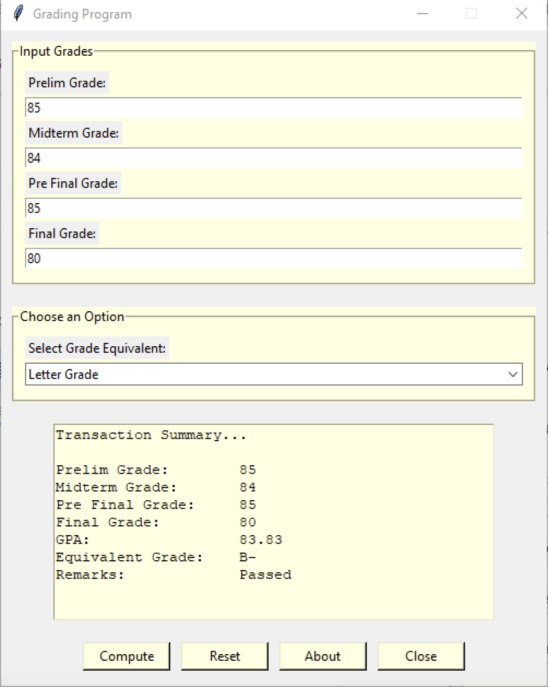

# Finals Task 5

# Source Code
import tkinter as tk
from tkinter import ttk, messagebox

def get_letter_grade(gpa):
   if 96 <= gpa <= 100:
       return "A"
   elif 93 <= gpa < 96:
       return "A+"
   elif 88 <= gpa < 93:
       return "B"
   elif 83 <= gpa < 88:
       return "B-"
   elif 78 <= gpa < 83:
       return "C"
   elif 76 <= gpa < 78:
       return "D"
   elif 75 == gpa:
       return "E"
   else:
       return "F"

def get_numeric_grade(gpa):
   if 97 <= gpa <= 100:
       return 1.00
   elif 94 <= gpa < 97:
       return 1.25
   elif 90 <= gpa < 94:
       return 1.50
   elif 87 <= gpa < 90:
       return 1.75
   elif 84 <= gpa < 87:
       return 2.00
   elif 81 <= gpa < 84:
       return 2.25
   elif 78 <= gpa < 81:
       return 2.50
   elif 76 <= gpa < 78:
       return 2.75
   elif 75 == gpa:
       return 3.00
   else:
       return 5.00

root = tk.Tk()
root.title("Grading Program")
root.geometry("500x600")
root.resizable(False, False)

frame_input = tk.LabelFrame(root, text="Input Grades", bg="light yellow", padx=10, pady=10)
frame_input.pack(padx=10, pady=10, fill="x")

labels = ["Prelim Grade:", "Midterm Grade:", "Pre Final Grade:", "Final Grade:"]
entries = []

for lbl in labels:
   tk.Label(frame_input, text=lbl).pack(anchor="w")
   entry = tk.Entry(frame_input)
   entry.pack(fill="x", pady=3)
   entries.append(entry)

frame_combo = tk.LabelFrame(root, text="Choose an Option", bg="light yellow", padx=10, pady=10)
frame_combo.pack(padx=10, pady=10, fill="x")

tk.Label(frame_combo, text="Select Grade Equivalent:").pack(anchor="w")

combo_choice = ttk.Combobox(frame_combo, values=["Letter Grade", "Numeric Grade"])
combo_choice.current(0)
combo_choice.pack(fill="x", pady=3)

text_output = tk.Text(root, bg="light yellow", height=11, width=50)
text_output.pack(padx=10, pady=10)

def compute():
   try:
       prelim = int(entries[0].get())
       midterm = int(entries[1].get())
       prefinal = int(entries[2].get())
       final = int(entries[3].get())
   except:
       messagebox.showerror("Input Error", "Please enter valid numeric grades!")
       return

   gpa = (prelim + midterm + (prefinal * 0.50) + (final * 0.50)) / 3

   if combo_choice.get() == "Letter Grade":
       equivalent = get_letter_grade(gpa)
   else:
       equivalent = get_numeric_grade(gpa)

   remarks = "Passed" if gpa >= 75 else "Failed"

   text_output.delete("1.0", tk.END)
   text_output.insert(tk.END,
                      f"Transaction Summary...\n\n"
                      f"{'Prelim Grade:':20} {prelim}\n"
                      f"{'Midterm Grade:':20} {midterm}\n"
                      f"{'Pre Final Grade:':20} {prefinal}\n"
                      f"{'Final Grade:':20} {final}\n"
                      f"{'GPA:':20} {round(gpa, 2)}\n"
                      f"{'Equivalent Grade:':20} {equivalent}\n"
                      f"{'Remarks:':20} {remarks}\n"
   )

def reset():
   for entry in entries:
       entry.delete(0, tk.END)

   text_output.delete("1.0", tk.END)
   combo_choice.current(0)

def about():
   messagebox.showinfo("About", "Hello I'm Jacob Gavin M. Due")

def close():
   root.destroy()

frame_buttons = tk.Frame(root)
frame_buttons.pack(pady=10)

btn_compute = tk.Button(frame_buttons, text="Compute", bg="light yellow", width=10, command=compute)
btn_compute.grid(row=0, column=0, padx=5)

btn_reset = tk.Button(frame_buttons, text="Reset", bg="light yellow", width=10, command=reset)
btn_reset.grid(row=0, column=1, padx=5)

btn_about = tk.Button(frame_buttons, text="About", bg="light yellow", width=10, command=about)
btn_about.grid(row=0, column=2, padx=5)

btn_close = tk.Button(frame_buttons, text="Close", bg="light yellow", width=10, command=close)
btn_close.grid(row=0, column=3, padx=5)

root.mainloop()

# Sample Output

