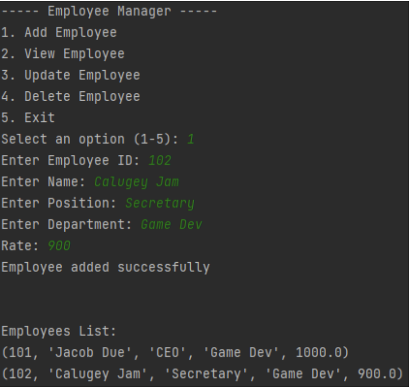
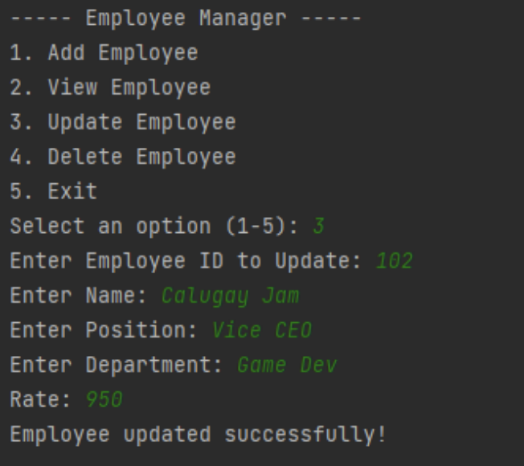
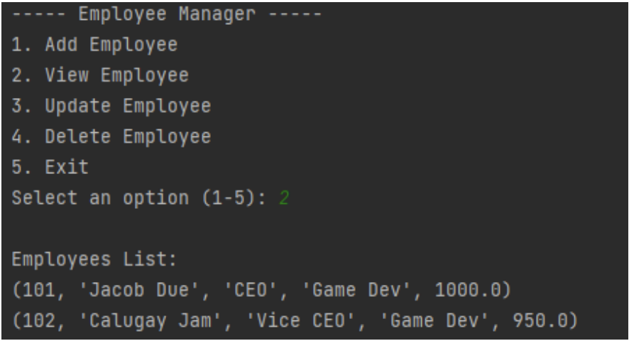
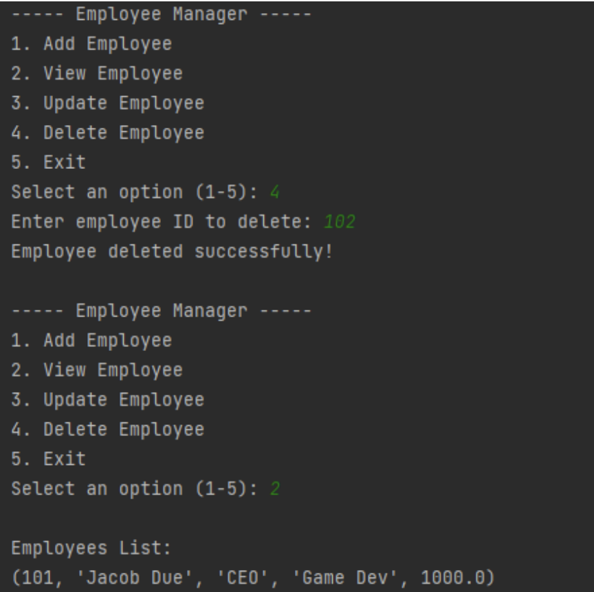
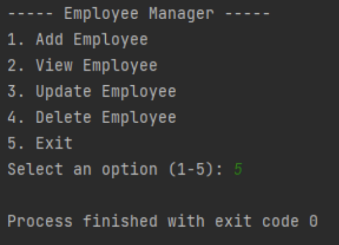

# Finals Task 6

# Source Code
import mysql.connector

#Connect to the SQLite database (it will create the DB file if not exists)

conn = mysql.connector.connect(
host="localhost", # Replace with your MySQL host (e.g., IP address or
hostname)
user="root", # Replace with your MySQL username
password="", # Replace with your MySQL password
database="employeedb" # Replace with the name of your database
)

cursor = conn.cursor()

def add_employee():
emp_id = input("Enter Employee ID: ")
fn = input("Enter Name: ")
post = input("Enter Position: ")
dept = input("Enter Department: ")
rate = float(input("Rate: "))
cursor.execute("INSERT INTO tbl_employee_info (emp_id,fn,post,dept,rate)"
"VALUES(%s,%s,%s,%s,%s)", (emp_id, fn, post, dept, rate))

conn.commit()
print("Employee added successfully\n")
view_employees()
#View all employees

def view_employees():
cursor.execute("SELECT * FROM tbl_employee_info")
rows = cursor.fetchall()
if rows:
print("\nEmployees List:")
for row in rows:
print(row)
else:

print("\nNo employees found.")
#print()

#Update employee
def update_employee():
emp_id = input("Enter Employee ID to Update: ")
fn = input("Enter Name: ")
post = input("Enter Position: ")
dept = input("Enter Department: ")
rate = float(input("Rate: "))
cursor.execute("UPDATE tbl_employee_info SET fn=%s, post=%s, dept=%s, rate=%s
WHERE emp_id=%s", (fn, post,dept,rate,emp_id))
conn.commit()
print("Employee updated successfully!\n")

#Delete employee
def delete_employee():
emp_id = input("Enter employee ID to delete: ")
cursor.execute("DELETE FROM tbl_employee_info WHERE emp_id=%s", (emp_id,))
conn.commit()
print("Employee deleted successfully!\n")
def main():
while True:
print("----- Employee Manager -----")
print("1. Add Employee")
print("2. View Employee")
print("3. Update Employee")
print("4. Delete Employee")
print("5. Exit")
choice = int(input("Select an option (1-5): "))
if (choice == 1):
add_employee()
elif (choice == 2):
view_employees()
elif (choice == 3):
update_employee()
elif (choice == 4):
delete_employee()
elif (choice == 5):
exit()
else:
print("Invalid, Numbers Only!!!")

if __name__ == '__main__':
main()

# Sample Output

