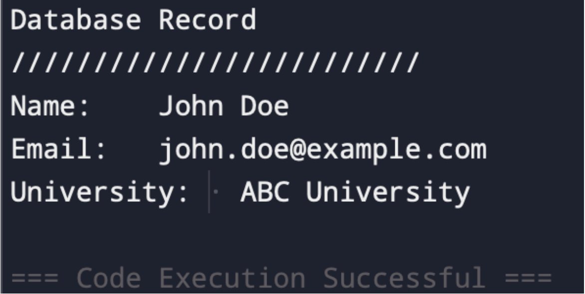
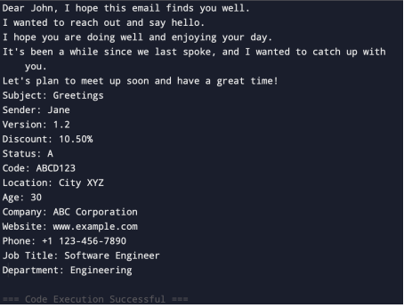
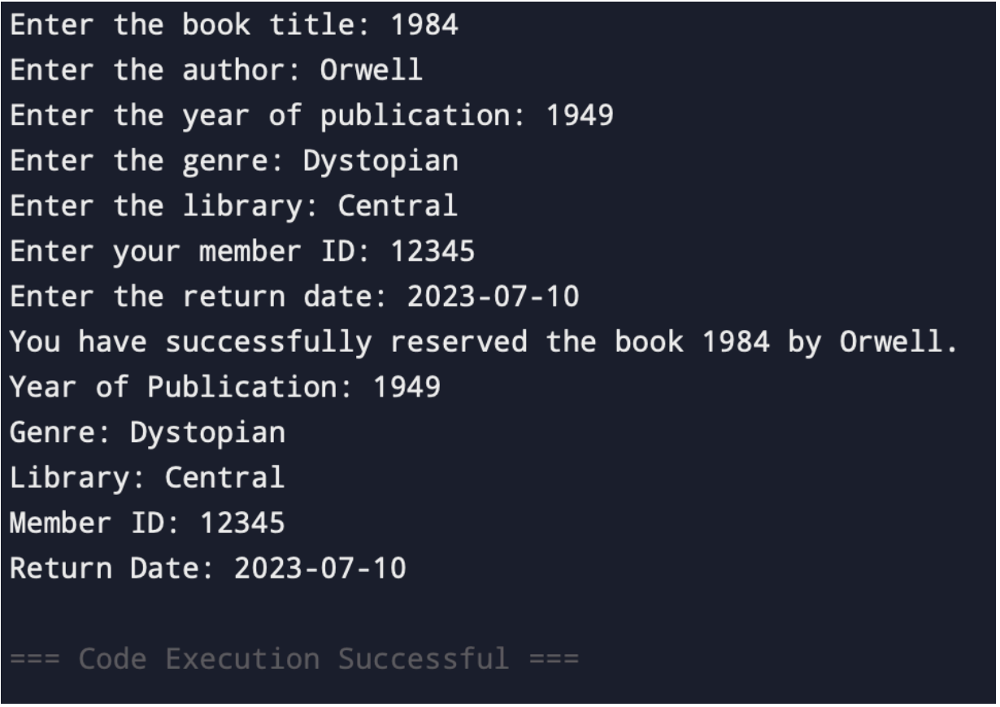
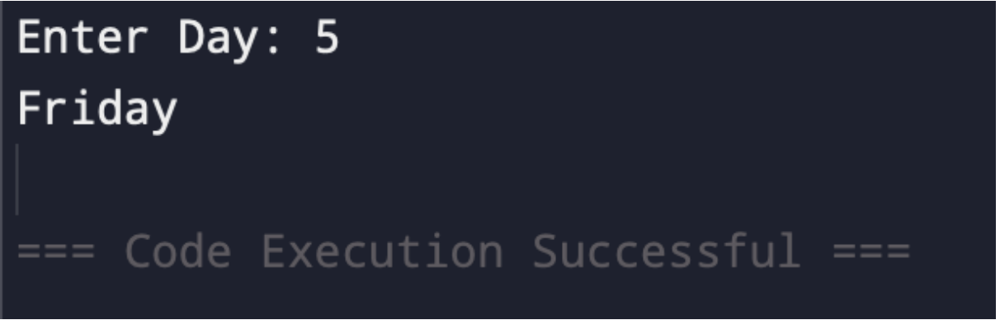

Midterm Lab Task 1

Problem 1. Use Appropriate Escape Sequence( \n, \t \b \ ..etc)
for the problem below

Source Code:
     
      name= "John Doe"
      email="john.doe@example.com"
      uni="ABC University"
      print("Database Record")
      print("\\\\\\\\\\\\\\\\\\\\\\\\\\\\\\\\\\")
      print("Name: \t",name)
      print("Email: \t",email)
      print("University: \t",uni)

Output:

Problem 2. Using Placeholders for Email Details: Use appropriate type specifiers %s, %d, %f
etc… for this task

Source Code:

        subject="Greetings"
        sender="Jane"
        version="1.2"
        discount="10.50%"
        status="A"
        code="ABCD123"
        location="City XYZ"
        age="30"
        company="ABC Corporation"
        website="www.example.com"
        phone="+1 123-456-7890"
        jobtitle="Software Engineer"
        department="Engineering"
        print("Dear John, I hope this email finds you well.")
        print("I wanted to reach out and say hello.")
        print("I hope you are doing well and enjoying your day.")
        print("It's been a while since we last spoke, and I wanted to catch up with you.")
        print("Let's plan to meet up soon and have a great time!")
        print("Subject: %s"%(subject))
        print("Sender: %s"%(sender))
        print("Version: %s"%(version))
        print("Discount: %s"%(discount))
        print("Status: %s"%(status))
        print("Code: %s"%(code))
        print("Location: %s"%(location))
        print("Age: %s"%(age))
        print("Company: %s"%(company))
        print("Website: %s"%(website))
        print("Phone: %s"%(phone))
        print("Job Title: %s"%(jobtitle))
        print("Department: %s"%(department))

Output:

Problem 3. Book Reservation; Accept User Input

Source Code:

    title= input ("Enter the book title: ")
    author= input ("Enter the author: ")
    year= input ("Enter the year of publication: ")
    genre= input ("Enter the genre: ")
    library= input ("Enter the library: ")
    memberid= input ("Enter your member ID: ")
    retdate= input ("Enter the return date: ")
    print("You have successfully reserved the book %s by %s."%(title,author))
    print("Year of Publication: %s"%(year))
    print("Genre: %s"%(genre))
    print("Library: %s"%(library))
    print("Member ID: %s"%(memberid))
    print("Return Date: %s"%(retdate))

Output:

Problem 4. Day Identifier

Source Code:

    number=input("Enter Day: ")
    if number=="1":
    print("Monday")
    elif number=="2":
    print("Tuesday")
    elif number=="3":
    print("Wednesday")
    elif number=="4":
    print("Thursday")
    elif number=="5":
    print("Friday")
    elif number=="6":
    print("Saturday")
    elif number=="7":
    print("Sunday")
    else:
    print("Invalid Value")

Output:

