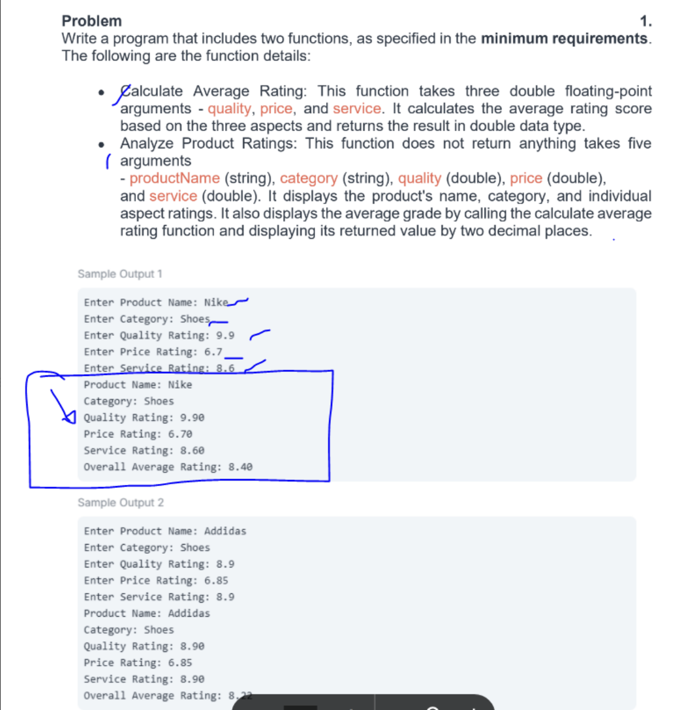
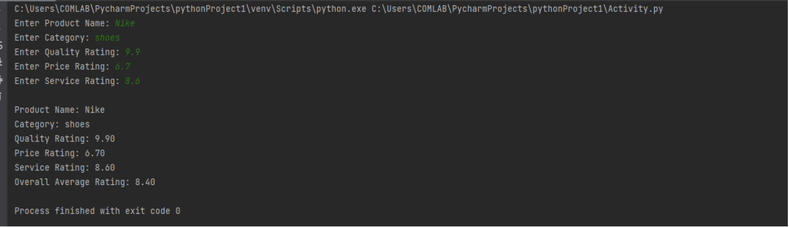
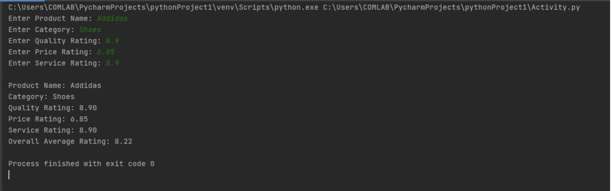

Midterm Lab Task 2

Source Code:

    def car(quality, price, service):
    return (quality + price + service) / 3
    def apr(prodname, cate, qual, pri, serv):
        print("\nProduct Name:", prodname)
        print("Category:", cate)
        print("Quality Rating:", f"{qual:.2f}")
        print("Price Rating:", f"{pri:.2f}")
        print("Service Rating:", f"{serv:.2f}")
        avg = car(qual, pri, serv)
        print("Overall Average Rating:", f"{avg:.2f}")
    prodname = input("Enter Product Name: ")
    cate = input("Enter Category: ")
    qual = float(input("Enter Quality Rating: "))
    pri = float(input("Enter Price Rating: "))
    serv = float(input("Enter Service Rating: "))
    apr(prodname, cate, qual, pri, serv)

Output:

Sample Output 1:

Sample Output 2:
